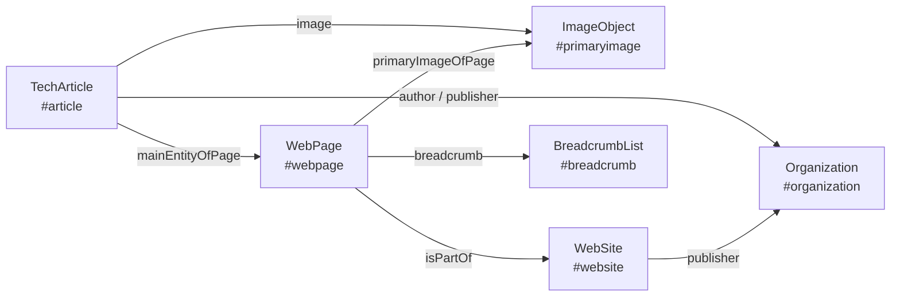

<div align="center">

# starlight-seo

**Search-ready titles, connected JSON-LD, complete Open Graph tags and a build-time SEO audit for [Starlight](https://starlight.astro.build/) documentation sites.**

[](https://github.com/kaktaknet/starlight-seo/actions/workflows/ci.yml)
[](https://www.npmjs.com/package/starlight-seo)
[](https://github.com/kaktaknet/starlight-seo/tags)
[](./LICENSE)
[](https://starlight.astro.build/)
[](https://astro.build/)
[](https://starlight.astro.build/resources/plugins/#community-plugins)
[](https://nodejs.org/)
[](./package.json)

**English** · [Русский](./README.ru.md)

</div>

---

## At a glance

| | |
|---|---|
| **What** | A Starlight plugin. One line in `astro.config`, one line in `content.config`. |
| **Problem** | Starlight uses one `title` for the sidebar, the `<h1>`, the `<title>` tag and `og:title`. A good sidebar label ("Git", "Docker", "Install") is a poor search result. |
| **Solution** | The sidebar and heading keep the short label. Search engines and social cards get a full title from `seo.title` or a per-section template. |
| **Also** | One JSON-LD `@graph` per page, breadcrumbs taken from the sidebar, Open Graph completion, and an audit that fails the build on weak metadata. |
| **How** | Starlight route middleware. No component overrides, no runtime dependencies, no build step. |
| **Built for** | Starlight **0.42** on Astro **7** - developed and tested on 0.42.5 and 7.3.5. |
| **Works with** | Starlight ≥ 0.32, Astro ≥ 5, Node ≥ 20. `site` must be set in the Astro config. |

```diff
- <title>Git | MCP Doc</title>
+ <title>Git MCP server: tools, setup and known vulnerabilities | MCP Doc</title>
```

The sidebar still says **Git**. The `<h1>` still says **Git**.

<details>
<summary><b>For AI agents: the whole repository in fifteen lines</b></summary>

```text
package      starlight-seo (ESM, plain JavaScript + hand-written .d.ts, zero dependencies)
versions     built for Starlight 0.42.x + Astro 7.x (tested 0.42.5 / 7.3.5); floor Starlight 0.32, Astro 5, Node 20
npm          https://www.npmjs.com/package/starlight-seo
install      pnpm add starlight-seo -> plugins: [starlightSeo()] -> docsSchema({ extend: seoSchema() })
entry        index.js       default export starlightSeo(options) -> Starlight plugin
schema       schema.js      seoSchema() -> pass to docsSchema({ extend })
middleware   middleware.js  runs after Starlight, rewrites route.head, pushes JSON-LD
core         core.js        pure functions for unit tests: normalize, resolvePage, graphOf, applyHead, serialize
lib/         title.js breadcrumbs.js graph.js head.js page.js options.js audit.js text.js
frontmatter  seo: { title, description, type, image, imageAlt, noindex, published, modified, section, keywords, about }
title order  seo.title -> first matching title.templates entry -> page title; site name appended only if it fits title.max
graph        WebSite, Organization|Person, WebPage, [ImageObject], [article type], BreadcrumbList, linked by @id
hooks        options.extend -> module exporting page(page, ctx) and graph(nodes, page, ctx)
audit        astro:build:done, reads built HTML, 14 rules, throws on level "error"
tests        pnpm test (node --test, unit) · pnpm test:fixture (builds tests/fixture with real Starlight)
```

Working instructions for agents live in [AGENTS.md](./AGENTS.md).

</details>

## Contents

- [Install](#install)
  - [By hand](#by-hand)
  - [With an AI agent](#with-an-ai-agent)
  - [Check that it works](#check-that-it-works)
- [Titles](#titles)
- [Frontmatter](#frontmatter)
- [Structured data](#structured-data)
- [Open Graph and robots](#open-graph-and-robots)
- [Untranslated pages](#untranslated-pages)
- [Build audit](#build-audit)
- [Options](#options)
- [Compatibility](#compatibility)
- [Prior art](#prior-art)
- [Development](#development)

## Install

The package is published on [npm](https://www.npmjs.com/package/starlight-seo).

### By hand

**1. Add the package.**

```sh
pnpm add starlight-seo
```

No pnpm yet? Run `npm install -g pnpm`, or `corepack enable pnpm` where your Node version bundles Corepack. A project that uses npm or yarn does not need pnpm at all - take the command below.

<details>
<summary>npm and yarn</summary>

```sh
npm install starlight-seo
yarn add starlight-seo
```

</details>

**2. Register the plugin.** `site` is required: canonical URLs and JSON-LD identifiers need an absolute origin.

```js
// astro.config.mjs
import { defineConfig } from 'astro/config'
import starlight from '@astrojs/starlight'
import starlightSeo from 'starlight-seo'

export default defineConfig({
  site: 'https://docs.example.com',
  integrations: [
    starlight({
      title: 'Example Docs',
      plugins: [
        starlightSeo({
          publisher: { name: 'Example Inc.', url: 'https://example.com/', logo: 'https://example.com/logo.png' },
          image: '/og.png',
        }),
      ],
    }),
  ],
})
```

**3. Add the frontmatter fields to the docs collection.**

```ts
// src/content.config.ts
import { defineCollection } from 'astro:content'
import { docsLoader } from '@astrojs/starlight/loaders'
import { docsSchema } from '@astrojs/starlight/schema'
import { seoSchema } from 'starlight-seo/schema'

export const collections = {
  docs: defineCollection({ loader: docsLoader(), schema: docsSchema({ extend: seoSchema() }) }),
}
```

If the collection already extends the schema, merge the two: `seoSchema().extend({ ...yourFields })`.

**4. Put a 1200 × 630 image at `public/og.png`**, or drop the `image` option and set the audit rule `'image.missing': 'off'`.

**5. Build.** Use the project's own build script if it has one. The audit prints what to improve.

```sh
pnpm astro build
```

Every page now has a JSON-LD graph, breadcrumbs and a social image. Titles improve as you add `seo.title` to pages or `title.templates` to the options.

What changes in the output right after the install: one JSON-LD graph with the identifiers listed under [Structured data](#structured-data), a `robots` meta tag with snippet directives, `og:type` set to `website` on non-article pages, and breadcrumbs built from the sidebar. Tests that assert on the old metadata shape need the new identifiers.

> [!IMPORTANT]
> If the site already writes its own JSON-LD, `og:image` or `<title>` in a `Head` override or in route middleware, remove that code. Two sources produce duplicate tags, and the audit rule `jsonld.mismatch` will report the disagreement.

### With an AI agent

Give your coding agent this prompt from the root of the Starlight project:

```text
Install the Starlight plugin https://github.com/kaktaknet/starlight-seo into this project.
Read its AGENTS.md first and follow the section "Installing into a site" step by step:
https://raw.githubusercontent.com/kaktaknet/starlight-seo/main/AGENTS.md
Use the package manager this repository already uses. Do not invent option names:
take them only from the README. Finish by running the build and report the audit output.
```

[AGENTS.md](./AGENTS.md) holds the same steps as above in a form an agent can execute and verify: what to detect first, which files to edit, what to remove, and the commands that prove the result. [CLAUDE.md](./CLAUDE.md) points Claude Code at the same file.

### Check that it works

```sh
pnpm astro build
grep -o '<title>[^<]*</title>' dist/index.html
grep -c 'application/ld+json' dist/index.html
```

Expected: the build ends with `[starlight-seo] audited N page(s): 0 error(s), ...`, the title is printed, and the count is `1`.

## Titles

The title is resolved in this order:

1. `seo.title` in the page frontmatter.
2. The first matching entry of `title.templates`.
3. The page `title`.

```md
---
title: Git
description: The reference Git server - twelve tools, the launch command and four fixed vulnerabilities.
seo:
  title: 'Git MCP server: tools, setup and known vulnerabilities'
---
```

```js
starlightSeo({
  title: {
    templates: [
      { match: '/sdk/*/', template: '{title} for MCP: install, versions, examples' },
      { match: '/servers/*/', template: { en: '{title} MCP server', ru: 'MCP-сервер {title}' } },
    ],
  },
})
```

`{title}` is the page title and `{site}` is the site name. Patterns are matched against the path without the locale prefix: `*` matches one segment, `**` matches any depth.

A site that already keeps its titles in one place does not need frontmatter. A template without `{title}` and with an exact path is a per-page title, and the `page` hook may return `title` from any data source:

```js
title: { templates: [{ match: '/faq/', template: 'Questions and answers about the Example API' }] }
```

The site name is appended (`Title | Site`) only while the result fits `title.max`. A title that already mentions the site name is left alone. `og:title` and JSON-LD always carry the title without the site name.

A long site name and `brand: 'always'` push most titles over `title.max`. Either raise `title.max`, or give titles a shorter suffix with `title.site`, or keep `'auto'` and let long titles go without the suffix.

| Option | Default | Meaning |
|---|---|---|
| `title.max` | `60` | longest full title; also the limit for appending the site name |
| `title.min` | `30` | shortest acceptable full title, used by the audit |
| `title.brand` | `'auto'` | `'auto'` appends the site name when it fits, `'always'`, `'never'` |
| `title.delimiter` | Starlight's `titleDelimiter` | separator before the site name |
| `title.site` | the site name | text appended to titles, when it should differ from the `WebSite` name |
| `title.templates` | `[]` | `{ match, template }` entries, first match wins |

## Frontmatter

Every field is optional and lives under `seo`.

| Field | Meaning |
|---|---|
| `title` | search title; the sidebar and `<h1>` keep `title` |
| `description` | overrides `description` for meta tags and JSON-LD |
| `type` | schema.org type of the page, for example `FAQPage` or `BlogPosting` |
| `image`, `imageAlt` | social image for this page |
| `noindex` | emits `noindex, follow` and takes the page out of the audit |
| `published`, `modified` | dates; `modified` defaults to Starlight's `lastUpdated` |
| `section`, `keywords` | `articleSection` and `keywords` of an article |
| `about` | what the page is about: a name or `{ name, sameAs, url, type }`, one or many |

Pages rendered with `<StarlightPage>` take the same fields:

```astro
<StarlightPage frontmatter={{ title, description, seo: { type: 'BlogPosting', published } }}>
```

## Structured data

Each page gets one `@graph` whose nodes reference each other by `@id`:



- `WebSite` and its publisher (`Organization` or `Person`, with logo and `sameAs`);
- `WebPage` with the breadcrumb, the primary image and the dates;
- for article types, an article node (`TechArticle` by default) that points at the page through `mainEntityOfPage`;
- `BreadcrumbList` built from the sidebar;
- `ImageObject` when the page has a social image.

The page type is `seo.type`, then the first match in `types`, then `WebPage` for the home page, `CollectionPage` for `template: splash`, and `defaultType` (`TechArticle`) for everything else.

```js
starlightSeo({
  site: {
    description: 'A reference on the Example API',
    about: { name: 'Example API', sameAs: 'https://www.wikidata.org/wiki/Q0' },
  },
  types: [{ match: '/blog/*/', type: 'BlogPosting', section: 'Blog' }],
  breadcrumbs: { groups: 'link', home: 'Docs' },
})
```

Node identifiers are stable and can be relied on in hooks and tests:

| Node | `@id` |
|---|---|
| `WebSite` | `<origin>/#website` |
| publisher | `publisher.id`, or `<publisher.url>#organization` (`#person` for a `Person`) |
| page | `<canonical>#webpage` |
| article | `<canonical>#article` |
| breadcrumbs | `<canonical>#breadcrumb` |
| image | `<canonical>#primaryimage` |

`inLanguage` is the Starlight `lang` of the page. `publisher` and `author` sit on the article node, not on `WebPage`. The crumb of the current page carries its sidebar label; nested groups that lead to the same page collapse into one crumb.

`breadcrumbs.groups` decides what a sidebar group becomes: `'link'` (default) points it at the first page of the group, `'plain'` keeps the name without a URL, `'skip'` leaves groups out.

### Site name, author and topic

Four things the plugin cannot decide for you. Each one has produced wrong metadata on a real site.

- **The site name is a name, not a domain.** `WebSite.name` and the title suffix come from the Starlight `title`, and so does `og:site_name`, which Starlight writes itself. Set the Starlight `title` to the human name (`Example Docs`, not `example.com`) and put the domain in `site.alternateName`. The plugin option `site.name` changes `WebSite.name` and the suffix only; `og:site_name` keeps following the Starlight `title`.
- **`author` defaults to the publisher.** That is false for a translation, a mirror or documentation of someone else's project. Replace it in the `graph` hook: find the node whose `@id` ends with `#article` and set `author` to the real organization or people.
- **`site.about` is the default topic of every article.** Pass one thing (`{ name, url, sameAs }`), a list, or a per-language map (`{ en: {...}, ru: {...} }`). Pages about something else need their own `seo.about` in frontmatter, otherwise every page claims the same subject.
- **The last breadcrumb takes the label of the current sidebar entry.** A custom page that marks a section link as current (a blog post under "Blog") gets the section name twice. Return `breadcrumbs` from the `page` hook with the last crumb labelled `page.label`.

### Adding your own nodes

Point `extend` at a module that exports `page`, `graph`, or both. The module runs on the server during rendering and may import your own data.

```js
starlightSeo({ extend: './src/seo.ts' })
```

```ts
// src/seo.ts
import type { SeoGraphHook, SeoPageHook } from 'starlight-seo'

export const page: SeoPageHook = (page) => {
  if (page.path.startsWith('/changelog/')) return { type: 'Article', section: 'Changelog' }
}

export const graph: SeoGraphHook = (nodes, page) => {
  if (page.path !== '/sdk/python/') return nodes
  return [
    ...nodes,
    {
      '@type': 'SoftwareSourceCode',
      '@id': `${page.url}#code`,
      name: 'Python SDK',
      programmingLanguage: 'Python',
      codeRepository: 'https://github.com/example/python-sdk',
      subjectOf: { '@id': `${page.url}#webpage` },
    },
  ]
}
```

`page` returns the fields to change before the head is written; a returned `title` gets the site name by the same rule as any other title. `graph` returns the final list of nodes and may add, change or remove any of them, the built-in ones included.

The plugin middleware runs after the site's own `routeMiddleware`, so it sees the head the site has already adjusted.

## Open Graph and robots

The plugin rewrites `og:title` and `og:description`, sets `og:type` to `website` for non-article pages, and adds `og:image` with its size and alternative text, `twitter:image`, and `article:published_time` / `article:modified_time`. Without an image `twitter:card` becomes `summary`.

`image` is a path, a URL, or a pattern with `{slug}`, `{lang}` and `{locale}`. `src` and `alt` accept a per-language record:

```js
starlightSeo({ image: { src: '/og/{slug}.png', width: 1200, height: 630, alt: 'Example Docs' } })
```

The plugin does not draw images. Any generator that writes files to that pattern works, for example [astro-og-canvas](https://github.com/delucis/astro-og-canvas) with a `src/pages/og/[...slug].ts` route. The audit reports an image that is missing from the build output.

A `robots` meta tag with `max-snippet:-1, max-image-preview:large, max-video-preview:-1` is added unless the page already has one. Set `robots: false` to turn it off, or pass your own string.

## Untranslated pages

When a locale has no translation, Starlight renders the default-language content under the locale URL. With the default `fallback: 'canonical'` such a page points its canonical URL at the source page, so search engines do not index the same text twice. Set `fallback: 'keep'` to leave the canonical URL as Starlight wrote it.

## Build audit

After `astro build` the plugin reads the generated HTML and reports problems. The build fails when a rule of level `error` fires.

```text
[starlight-seo] title.short: 36 page(s)
[starlight-seo]   /deployment/docker/  16 < 30: Docker | MCP Doc
[starlight-seo]   /deployment/ubuntu/  15 < 30: Linux | MCP Doc
[starlight-seo] audited 98 page(s): 0 error(s), 36 warning(s)
```

| Rule | Default | Fires when |
|---|---|---|
| `title.missing` | error | there is no `<title>` |
| `title.short` | warn | the title is shorter than `title.min` |
| `title.long` | warn | the title is longer than `title.max` |
| `title.duplicate` | error | two pages share a title |
| `description.missing` | error | there is no meta description |
| `description.short` | warn | shorter than `description.min` (70) |
| `description.long` | warn | longer than `description.max` (160) |
| `description.duplicate` | error | two pages share a description |
| `canonical.missing` | error | there is no canonical link |
| `jsonld.missing` | warn | the page has no JSON-LD |
| `jsonld.invalid` | error | a JSON-LD block does not parse |
| `jsonld.mismatch` | error | the graph and `og:title` disagree about the page title |
| `image.missing` | warn | there is no `og:image` |
| `image.broken` | error | a same-origin `og:image` is not in the build output |

Redirect pages, `noindex` pages and pages whose canonical URL points elsewhere are not audited. Lengths are counted in characters, not bytes. The log shows the first 15 pages per rule; `audit.limit` changes that, and the `audit()` function returns every finding.

```js
starlightSeo({
  audit: {
    failOn: 'error',
    exclude: ['/go/**'],
    rules: { 'title.short': 'error', 'image.missing': 'off' },
  },
})
```

`failOn` is `'error'` (default), `'warn'` or `'off'`. `audit: false` disables the audit. `audit.exclude` is matched against output paths, locale prefix included.

The same check is available as a function:

```js
import { audit, normalize } from 'starlight-seo'

const result = await audit('dist', normalize({}, { site: 'https://docs.example.com' }))
```

The pure functions behind the middleware are exported from `starlight-seo/core` (`normalize`, `resolvePage`, `graphOf`, `applyHead`, `serialize`), so a site can unit-test its own configuration without a build.

## Options

| Option | Default | Meaning |
|---|---|---|
| `site.name` | Starlight `title` | site name in titles and JSON-LD |
| `site.alternateName`, `site.description`, `site.about` | - | `WebSite` fields; `about` is also the default topic of every article |
| `publisher` | the site itself | `{ type, id, name, url, logo, sameAs }` |
| `title`, `description` | see above | length limits and title templates |
| `types`, `defaultType` | `[]`, `'TechArticle'` | page types by path |
| `image` | none | default social image or pattern |
| `robots` | snippet directives | `robots` meta content, or `false` |
| `breadcrumbs` | `{ groups: 'link' }` | group handling and the label of the first crumb |
| `fallback` | `'canonical'` | canonical URL of untranslated pages |
| `exclude` | `['/404/', '/404.html']` | paths the plugin leaves untouched: no title, no image, no JSON-LD. The 404 page keeps whatever the site gives it |
| `extend` | none | module with `page` and `graph` hooks |
| `audit` | on, `failOn: 'error'` | build audit |

Every text option accepts a string or a per-language record: `{ en: 'Docs', ru: 'Документация' }`.

## Compatibility

| | Built for and tested on | Lowest supported | Why that floor |
|---|---|---|---|
| Starlight | 0.42.5 | 0.32 | the `config:setup` hook and plugin route middleware appeared in 0.32 |
| Astro | 7.3.5 | 5 | Starlight 0.32 requires Astro 5 |
| Node | 22, 24 | 20 | |

Versions between the floor and the tested release are expected to work, but only the tested pair is exercised by the fixture build. If a newer Starlight changes the shape of `route.head` or `route.sidebar`, `pnpm test:fixture` is the test that shows it.

Pages rendered outside Starlight - plain `src/pages/*.astro` routes that do not use `<StarlightPage>` - are not touched by the middleware, but the audit still reads them. A non-root Astro `base` is not handled yet.

## Prior art

The plugin packages a technique that many Starlight sites implement by hand in their own route middleware:

- breadcrumbs from the sidebar tree and JSON-LD pushed into `route.head` - the [Nx docs](https://github.com/nrwl/nx/blob/master/astro-docs/src/plugins/schema.middleware.ts);
- canonical URL read from the head Starlight already built, Open Graph completion and the `og:type` fix - the [Arcjet docs](https://github.com/arcjet/arcjet-docs/blob/main/src/routeData.ts);
- typed structured data for blog pages - [starlight-blog](https://github.com/HiDeoo/starlight-blog);
- one graph of nodes linked by `@id` - [seo-graph](https://github.com/jdevalk/seo-graph);
- auditing the final HTML and failing the build - [astro-seo-enforcer](https://github.com/SlashGordon/astro-seo-enforcer).

## Development

```sh
pnpm install
pnpm test
pnpm test:fixture
```

`pnpm test` runs the unit tests. `pnpm test:fixture` builds a real Starlight site from `tests/fixture` with the plugin and checks the generated HTML.

Changes are listed in [CHANGELOG.md](./CHANGELOG.md). Bugs and ideas go to [issues](https://github.com/kaktaknet/starlight-seo/issues).

## License

[MIT](./LICENSE) © [kaktak.net](https://kaktak.net/)
