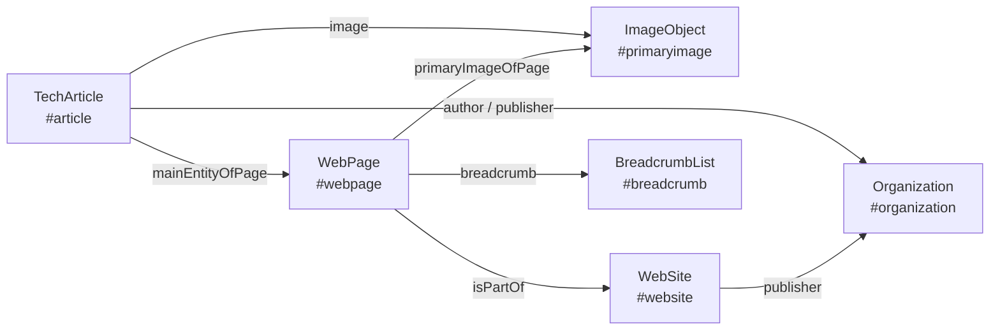

<div align="center">

# starlight-seo

**Заголовки под поиск, связанный JSON-LD, полный набор Open Graph и проверка SEO при сборке для сайтов документации на [Starlight](https://starlight.astro.build/).**

[](https://github.com/kaktaknet/starlight-seo/actions/workflows/ci.yml)
[](https://github.com/kaktaknet/starlight-seo/tags)
[](./LICENSE)
[](https://starlight.astro.build/)
[](https://astro.build/)
[](https://nodejs.org/)
[](./package.json)

[English](./README.md) · **Русский**

</div>

---

## Коротко

| | |
|---|---|
| **Что это** | Плагин для Starlight. Одна строка в `astro.config`, одна строка в `content.config`. |
| **Проблема** | В Starlight одно поле `title` служит пунктом бокового меню, заголовком `<h1>`, тегом `<title>` и `og:title`. Хорошее название для меню («Git», «Docker», «Установка») - плохой результат в поиске. |
| **Решение** | Меню и заголовок страницы сохраняют короткое название. Поисковики и карточки в соцсетях получают полный заголовок из `seo.title` или из шаблона раздела. |
| **Ещё** | Один граф JSON-LD на страницу, хлебные крошки из бокового меню, достройка Open Graph и проверка, которая останавливает сборку при слабых метаданных. |
| **Как устроен** | Обработчик маршрута Starlight. Компоненты не подменяются, зависимостей нет, шага сборки нет. |
| **Сделан для** | Starlight **0.42** на Astro **7** - разработан и проверен на 0.42.5 и 7.3.5. |
| **Работает с** | Starlight ≥ 0.32, Astro ≥ 5, Node ≥ 20. В настройках Astro должен быть задан `site`. |

```diff
- <title>Git | MCP Doc</title>
+ <title>MCP-сервер Git: инструменты, запуск и известные уязвимости | MCP Doc</title>
```

В меню по-прежнему **Git**. В `<h1>` по-прежнему **Git**.

<details>
<summary><b>Для ИИ-агентов: весь репозиторий в четырнадцати строках</b></summary>

```text
package      starlight-seo (ESM, plain JavaScript + hand-written .d.ts, zero dependencies)
versions     built for Starlight 0.42.x + Astro 7.x (tested 0.42.5 / 7.3.5); floor Starlight 0.32, Astro 5, Node 20
install      pnpm add github:kaktaknet/starlight-seo#v0.2.0 -> plugins: [starlightSeo()] -> docsSchema({ extend: seoSchema() })
entry        index.js       default export starlightSeo(options) -> Starlight plugin
schema       schema.js      seoSchema() -> pass to docsSchema({ extend })
middleware   middleware.js  runs after Starlight, rewrites route.head, pushes JSON-LD
core         core.js        pure functions for unit tests: normalize, resolvePage, graphOf, applyHead, serialize
lib/         title.js breadcrumbs.js graph.js head.js page.js options.js audit.js text.js
frontmatter  seo: { title, description, type, image, imageAlt, noindex, published, modified, section, keywords, about }
title order  seo.title -> first matching title.templates entry -> page title; site name appended only if it fits title.max
graph        WebSite, Organization|Person, WebPage, [ImageObject], [article type], BreadcrumbList, linked by @id
hooks        options.extend -> module exporting page(page, ctx) and graph(nodes, page, ctx)
audit        astro:build:done, reads built HTML, 14 rules, throws on level "error"
tests        pnpm test (node --test, unit) · pnpm test:fixture (builds tests/fixture with real Starlight)
```

Рабочие инструкции для агентов - в [AGENTS.md](./AGENTS.md) (на английском).

</details>

## Содержание

- [Установка](#установка)
  - [Вручную](#вручную)
  - [С помощью ИИ-агента](#с-помощью-ии-агента)
  - [Как убедиться, что всё работает](#как-убедиться-что-всё-работает)
- [Заголовки](#заголовки)
- [Поля frontmatter](#поля-frontmatter)
- [Структурированные данные](#структурированные-данные)
- [Open Graph и robots](#open-graph-и-robots)
- [Непереведённые страницы](#непереведённые-страницы)
- [Проверка при сборке](#проверка-при-сборке)
- [Настройки](#настройки)
- [Совместимость](#совместимость)
- [Откуда взяты приёмы](#откуда-взяты-приёмы)
- [Разработка](#разработка)

## Установка

Пакет ставится из GitHub. Указывайте метку выпуска, чтобы сборка оставалась воспроизводимой.

### Вручную

**1. Добавьте пакет.**

```sh
pnpm add github:kaktaknet/starlight-seo#v0.2.0
```

<details>
<summary>npm и yarn</summary>

```sh
npm install github:kaktaknet/starlight-seo#v0.2.0
yarn add starlight-seo@github:kaktaknet/starlight-seo#v0.2.0
```

</details>

**2. Подключите плагин.** Поле `site` обязательно: каноническим адресам и идентификаторам JSON-LD нужен полный адрес сайта.

```js
// astro.config.mjs
import { defineConfig } from 'astro/config'
import starlight from '@astrojs/starlight'
import starlightSeo from 'starlight-seo'

export default defineConfig({
  site: 'https://docs.example.com',
  integrations: [
    starlight({
      title: 'Example Docs',
      plugins: [
        starlightSeo({
          publisher: { name: 'Example Inc.', url: 'https://example.com/', logo: 'https://example.com/logo.png' },
          image: '/og.png',
        }),
      ],
    }),
  ],
})
```

**3. Добавьте поля frontmatter в коллекцию документации.**

```ts
// src/content.config.ts
import { defineCollection } from 'astro:content'
import { docsLoader } from '@astrojs/starlight/loaders'
import { docsSchema } from '@astrojs/starlight/schema'
import { seoSchema } from 'starlight-seo/schema'

export const collections = {
  docs: defineCollection({ loader: docsLoader(), schema: docsSchema({ extend: seoSchema() }) }),
}
```

Если коллекция уже расширяет схему, объедините их: `seoSchema().extend({ ...вашиПоля })`.

**4. Положите картинку 1200 × 630 в `public/og.png`** или уберите настройку `image` и выключите правило проверки: `'image.missing': 'off'`.

**5. Соберите сайт.** Если у проекта есть своя команда сборки, используйте её. Проверка покажет, что стоит улучшить.

```sh
pnpm astro build
```

Теперь у каждой страницы есть граф JSON-LD, хлебные крошки и картинка для соцсетей. Заголовки улучшаются по мере того, как вы добавляете `seo.title` страницам или `title.templates` в настройки.

Что меняется на страницах сразу после установки: один граф JSON-LD с идентификаторами из раздела [Структурированные данные](#структурированные-данные), мета-тег `robots` с директивами сниппета, `og:type` со значением `website` на страницах, которые не являются статьями, и крошки, построенные по боковому меню. Тестам, которые проверяют прежний вид метаданных, нужны новые идентификаторы.

> [!IMPORTANT]
> Если сайт уже сам пишет JSON-LD, `og:image` или `<title>` в подменённом компоненте `Head` или в обработчике маршрута, удалите этот код. Два источника дают повторяющиеся теги, и правило `jsonld.mismatch` сообщит о расхождении.

### С помощью ИИ-агента

Дайте агенту эту задачу из корня проекта на Starlight:

```text
Install the Starlight plugin https://github.com/kaktaknet/starlight-seo into this project.
Read its AGENTS.md first and follow the section "Installing into a site" step by step:
https://raw.githubusercontent.com/kaktaknet/starlight-seo/main/AGENTS.md
Use the package manager this repository already uses. Do not invent option names:
take them only from the README. Finish by running the build and report the audit output.
```

В [AGENTS.md](./AGENTS.md) те же шаги записаны так, чтобы агент мог их выполнить и проверить: что определить сначала, какие файлы править, что удалить и какими командами подтвердить результат. Там же указано, для каких версий Starlight и Astro сделан плагин. [CLAUDE.md](./CLAUDE.md) направляет Claude Code в тот же файл.

### Как убедиться, что всё работает

```sh
pnpm astro build
grep -o '<title>[^<]*</title>' dist/index.html
grep -c 'application/ld+json' dist/index.html
```

Ожидаемый результат: сборка заканчивается строкой `[starlight-seo] audited N page(s): 0 error(s), ...`, заголовок напечатан, счётчик равен `1`.

## Заголовки

Заголовок выбирается в таком порядке:

1. `seo.title` во frontmatter страницы.
2. Первая подошедшая запись из `title.templates`.
3. Поле `title` страницы.

```md
---
title: Git
description: Эталонный сервер Git - 12 инструментов, команда запуска и четыре исправленные уязвимости.
seo:
  title: 'MCP-сервер Git: инструменты, запуск и известные уязвимости'
---
```

```js
starlightSeo({
  title: {
    templates: [
      { match: '/sdk/*/', template: 'MCP {title}: установка, версии и примеры' },
      { match: '/servers/*/', template: { en: '{title} MCP server', ru: 'MCP-сервер {title}' } },
    ],
  },
})
```

`{title}` - название страницы, `{site}` - название сайта. Шаблоны сравниваются с путём без префикса языка: `*` соответствует одному сегменту, `**` - любой глубине.

Сайту, который уже хранит заголовки в одном месте, frontmatter не нужен. Шаблон без `{title}` с точным путём - это заголовок одной страницы, а функция `page` может вернуть `title` из любого источника данных:

```js
title: { templates: [{ match: '/faq/', template: 'Вопросы и ответы об Example API' }] }
```

Название сайта дописывается (`Заголовок | Сайт`), только пока результат помещается в `title.max`. Заголовок, в котором название сайта уже есть, не меняется. В `og:title` и JSON-LD заголовок всегда идёт без названия сайта.

Длинное название сайта вместе с `brand: 'always'` выводит большинство заголовков за `title.max`. Можно поднять `title.max`, задать более короткий хвост через `title.site` или оставить `'auto'`: тогда длинные заголовки идут без названия сайта.

| Настройка | По умолчанию | Смысл |
|---|---|---|
| `title.max` | `60` | наибольшая длина полного заголовка; она же предел для дописывания названия сайта |
| `title.min` | `30` | наименьшая допустимая длина, используется проверкой |
| `title.brand` | `'auto'` | `'auto'` дописывает название сайта, если оно помещается; `'always'`; `'never'` |
| `title.delimiter` | `titleDelimiter` из Starlight | разделитель перед названием сайта |
| `title.site` | название сайта | текст, который дописывается к заголовкам, если он должен отличаться от имени `WebSite` |
| `title.templates` | `[]` | записи `{ match, template }`, действует первая подошедшая |

## Поля frontmatter

Все поля необязательны и находятся внутри `seo`.

| Поле | Смысл |
|---|---|
| `title` | заголовок для поиска; меню и `<h1>` берут `title` |
| `description` | заменяет `description` в мета-тегах и JSON-LD |
| `type` | тип страницы по schema.org, например `FAQPage` или `BlogPosting` |
| `image`, `imageAlt` | картинка для соцсетей у этой страницы |
| `noindex` | выводит `noindex, follow` и исключает страницу из проверки |
| `published`, `modified` | даты; `modified` по умолчанию берётся из `lastUpdated` Starlight |
| `section`, `keywords` | `articleSection` и `keywords` статьи |
| `about` | о чём страница: название или `{ name, sameAs, url, type }`, одно или несколько |

Страницы, собранные через `<StarlightPage>`, принимают те же поля:

```astro
<StarlightPage frontmatter={{ title, description, seo: { type: 'BlogPosting', published } }}>
```

## Структурированные данные

Каждая страница получает один `@graph`, узлы которого ссылаются друг на друга через `@id`:



- `WebSite` и его издатель (`Organization` или `Person`, с логотипом и `sameAs`);
- `WebPage` с крошками, главной картинкой и датами;
- для статей - узел статьи (по умолчанию `TechArticle`), который указывает на страницу через `mainEntityOfPage`;
- `BreadcrumbList`, построенный по боковому меню;
- `ImageObject`, если у страницы есть картинка для соцсетей.

Тип страницы - это `seo.type`, затем первое совпадение в `types`, затем `WebPage` для главной, `CollectionPage` для `template: splash` и `defaultType` (`TechArticle`) для остальных.

```js
starlightSeo({
  site: {
    description: 'Справочник по Example API',
    about: { name: 'Example API', sameAs: 'https://www.wikidata.org/wiki/Q0' },
  },
  types: [{ match: '/blog/*/', type: 'BlogPosting', section: 'Блог' }],
  breadcrumbs: { groups: 'link', home: 'Главная' },
})
```

Идентификаторы узлов постоянны, на них можно опираться в своих функциях и тестах:

| Узел | `@id` |
|---|---|
| `WebSite` | `<адрес сайта>/#website` |
| издатель | `publisher.id` или `<publisher.url>#organization` (`#person` для `Person`) |
| страница | `<канонический адрес>#webpage` |
| статья | `<канонический адрес>#article` |
| крошки | `<канонический адрес>#breadcrumb` |
| картинка | `<канонический адрес>#primaryimage` |

`inLanguage` - это `lang` страницы в Starlight. `publisher` и `author` стоят на узле статьи, а не на `WebPage`. Крошка текущей страницы несёт её название из бокового меню; вложенные группы, ведущие на одну страницу, сливаются в одну крошку.

`breadcrumbs.groups` определяет, чем станет группа бокового меню: `'link'` (по умолчанию) ведёт на первую страницу группы, `'plain'` оставляет название без адреса, `'skip'` пропускает группы.

### Свои узлы

Укажите в `extend` модуль, который экспортирует `page`, `graph` или обе функции. Модуль выполняется на сервере во время отрисовки и может читать ваши данные.

```js
starlightSeo({ extend: './src/seo.ts' })
```

```ts
// src/seo.ts
import type { SeoGraphHook, SeoPageHook } from 'starlight-seo'

export const page: SeoPageHook = (page) => {
  if (page.path.startsWith('/changelog/')) return { type: 'Article', section: 'Changelog' }
}

export const graph: SeoGraphHook = (nodes, page) => {
  if (page.path !== '/sdk/python/') return nodes
  return [
    ...nodes,
    {
      '@type': 'SoftwareSourceCode',
      '@id': `${page.url}#code`,
      name: 'Python SDK',
      programmingLanguage: 'Python',
      codeRepository: 'https://github.com/example/python-sdk',
      subjectOf: { '@id': `${page.url}#webpage` },
    },
  ]
}
```

`page` возвращает поля, которые нужно изменить до записи `<head>`; возвращённый `title` получает название сайта по тому же правилу, что и любой другой заголовок. `graph` возвращает итоговый список узлов и может добавлять, менять и удалять любые из них, включая встроенные.

Обработчик плагина выполняется после собственного `routeMiddleware` сайта и видит `<head>`, который сайт уже поправил.

## Open Graph и robots

Плагин переписывает `og:title` и `og:description`, ставит `og:type` равным `website` для страниц, которые не являются статьями, и добавляет `og:image` с размерами и описанием, `twitter:image`, а также `article:published_time` и `article:modified_time`. Без картинки `twitter:card` становится `summary`.

`image` - это путь, адрес или шаблон с `{slug}`, `{lang}` и `{locale}`. Поля `src` и `alt` принимают запись по языкам:

```js
starlightSeo({ image: { src: '/og/{slug}.png', width: 1200, height: 630, alt: 'Example Docs' } })
```

Плагин не рисует картинки. Подойдёт любой генератор, который кладёт файлы по такому шаблону, например [astro-og-canvas](https://github.com/delucis/astro-og-canvas) с маршрутом `src/pages/og/[...slug].ts`. Проверка сообщит о картинке, которой нет в собранном сайте.

Мета-тег `robots` со значением `max-snippet:-1, max-image-preview:large, max-video-preview:-1` добавляется, если у страницы нет своего. `robots: false` его отключает, строка задаёт своё значение.

## Непереведённые страницы

Если для языка нет перевода, Starlight показывает текст на основном языке по адресу этого языка. При значении по умолчанию `fallback: 'canonical'` такая страница указывает каноническим адресом на исходную, и поисковик не индексирует один текст дважды. `fallback: 'keep'` оставляет канонический адрес таким, каким его записал Starlight.

## Проверка при сборке

После `astro build` плагин читает готовый HTML и сообщает о проблемах. Сборка останавливается, если сработало правило уровня `error`.

```text
[starlight-seo] title.short: 36 page(s)
[starlight-seo]   /deployment/docker/  16 < 30: Docker | MCP Doc
[starlight-seo]   /deployment/ubuntu/  15 < 30: Linux | MCP Doc
[starlight-seo] audited 98 page(s): 0 error(s), 36 warning(s)
```

| Правило | По умолчанию | Когда срабатывает |
|---|---|---|
| `title.missing` | error | нет `<title>` |
| `title.short` | warn | заголовок короче `title.min` |
| `title.long` | warn | заголовок длиннее `title.max` |
| `title.duplicate` | error | у двух страниц один заголовок |
| `description.missing` | error | нет мета-описания |
| `description.short` | warn | короче `description.min` (70) |
| `description.long` | warn | длиннее `description.max` (160) |
| `description.duplicate` | error | у двух страниц одно описание |
| `canonical.missing` | error | нет канонической ссылки |
| `jsonld.missing` | warn | на странице нет JSON-LD |
| `jsonld.invalid` | error | блок JSON-LD не разбирается |
| `jsonld.mismatch` | error | граф и `og:title` называют страницу по-разному |
| `image.missing` | warn | нет `og:image` |
| `image.broken` | error | `og:image` с того же сайта отсутствует в сборке |

Страницы-перенаправления, страницы с `noindex` и страницы, чей канонический адрес ведёт в другое место, не проверяются. Длина считается в знаках, а не в байтах. В журнале сборки показаны первые 15 страниц по каждому правилу; предел меняет `audit.limit`, а функция `audit()` возвращает все находки.

```js
starlightSeo({
  audit: {
    failOn: 'error',
    exclude: ['/go/**'],
    rules: { 'title.short': 'error', 'image.missing': 'off' },
  },
})
```

`failOn` принимает `'error'` (по умолчанию), `'warn'` или `'off'`. `audit: false` отключает проверку. `audit.exclude` сравнивается с путями в собранном сайте, включая префикс языка.

Та же проверка доступна как функция:

```js
import { audit, normalize } from 'starlight-seo'

const result = await audit('dist', normalize({}, { site: 'https://docs.example.com' }))
```

Чистые функции, на которых построен обработчик, экспортируются из `starlight-seo/core` (`normalize`, `resolvePage`, `graphOf`, `applyHead`, `serialize`). Сайт может проверять свою настройку модульными тестами, без сборки.

## Настройки

| Настройка | По умолчанию | Смысл |
|---|---|---|
| `site.name` | `title` из Starlight | название сайта в заголовках и JSON-LD |
| `site.alternateName`, `site.description`, `site.about` | - | поля `WebSite`; `about` также служит темой каждой статьи по умолчанию |
| `publisher` | сам сайт | `{ type, id, name, url, logo, sameAs }` |
| `title`, `description` | см. выше | пределы длины и шаблоны заголовков |
| `types`, `defaultType` | `[]`, `'TechArticle'` | типы страниц по путям |
| `image` | нет | картинка для соцсетей по умолчанию или шаблон |
| `robots` | директивы сниппета | содержимое мета-тега `robots` или `false` |
| `breadcrumbs` | `{ groups: 'link' }` | обработка групп и название первой крошки |
| `fallback` | `'canonical'` | канонический адрес непереведённых страниц |
| `exclude` | `['/404/', '/404.html']` | пути, которые плагин не трогает: ни заголовка, ни картинки, ни JSON-LD. Страница 404 сохраняет то, что даёт ей сайт |
| `extend` | нет | модуль с функциями `page` и `graph` |
| `audit` | включена, `failOn: 'error'` | проверка при сборке |

Любая текстовая настройка принимает строку или запись по языкам: `{ en: 'Docs', ru: 'Документация' }`.

## Совместимость

| | Сделан для и проверен на | Наименьшая поддерживаемая | Откуда нижняя граница |
|---|---|---|---|
| Starlight | 0.42.5 | 0.32 | точка расширения `config:setup` и обработчики маршрута для плагинов появились в 0.32 |
| Astro | 7.3.5 | 5 | Starlight 0.32 требует Astro 5 |
| Node | 22, 24 | 20 | |

Версии между нижней границей и проверенным выпуском должны работать, но сборкой проверочного сайта подтверждена только проверенная пара. Если новый Starlight изменит устройство `route.head` или `route.sidebar`, это покажет `pnpm test:fixture`.

Страницы вне Starlight - обычные маршруты `src/pages/*.astro` без `<StarlightPage>` - обработчик не затрагивает, но проверка их читает. Настройка `base` в Astro, отличная от корня, пока не учитывается.

## Откуда взяты приёмы

Плагин собирает в одно целое приём, который многие сайты на Starlight пишут вручную в собственном обработчике маршрута:

- крошки из дерева бокового меню и JSON-LD, добавленный в `route.head` - [документация Nx](https://github.com/nrwl/nx/blob/master/astro-docs/src/plugins/schema.middleware.ts);
- канонический адрес, взятый из уже собранного `<head>`, достройка Open Graph и исправление `og:type` - [документация Arcjet](https://github.com/arcjet/arcjet-docs/blob/main/src/routeData.ts);
- типизированные структурированные данные для страниц блога - [starlight-blog](https://github.com/HiDeoo/starlight-blog);
- единый граф узлов, связанных через `@id` - [seo-graph](https://github.com/jdevalk/seo-graph);
- проверка готового HTML с остановкой сборки - [astro-seo-enforcer](https://github.com/SlashGordon/astro-seo-enforcer).

## Разработка

```sh
pnpm install
pnpm test
pnpm test:fixture
```

`pnpm test` запускает модульные тесты. `pnpm test:fixture` собирает настоящий сайт на Starlight из `tests/fixture` с плагином и проверяет готовый HTML.

Изменения перечислены в [CHANGELOG.md](./CHANGELOG.md). Ошибки и предложения - в [issues](https://github.com/kaktaknet/starlight-seo/issues).

## Лицензия

[MIT](./LICENSE) © [kaktak.net](https://kaktak.net/)
